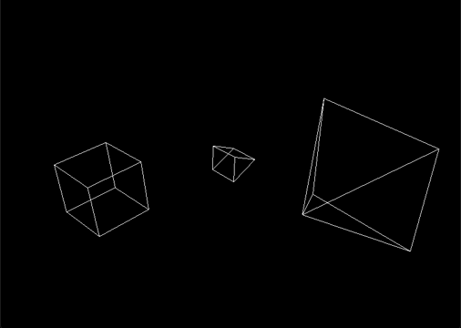

# C 3D Graphic Engine
> **C3DGraphicEngine** - это кроссплатформенный графический 3D движок, написанный с полного нуля на чистом С!
### [Скачайте](https://github.com/StepanovPlaton/C3DGraphicEngine/raw/refs/heads/main/builds/v0.11.exe) и попробуйте сами!




## Стек:
- [C23](https://ru.wikipedia.org/wiki/C23)
- [windows.h](https://ru.wikipedia.org/wiki/Windows.h)
- ВСЁ! :smirk:

## О проекте:
- Графический 3D движок 
- Весит всего 75 Kb!
- Первая версия написана за 8 часов!
- Рендерит произвольные объекты, заданные как наборы вершин и ребер
- Реализует сцену с произвольным позиционированием камеры
- Использует перспективную проекцию
- Создан с полного нуля - не использует продвинутые графические библиотеки
- Имеет несколько целей сборки под разные платформы, используя платформозависимый API для рендера графических примитивов: 
  - Сборка под Windows основана на [Windows API](https://ru.wikipedia.org/wiki/Windows_API)
  - Сборка под *Unix основана на [X11/Xlib](https://ru.wikipedia.org/wiki/Xlib) *(coming soon)*
- Реализация движка не зависит от выбранной для сборки графической библиотеки конкретной платформы и ее API
  
## Запуск:
- **Windows**:
  ```bash
  make win
  make run_win
  ```
  
## Идеи:
- [ ] Добавить непрозрачность (скрыть невидимые грани)
- [ ] Добавить рендер с помощью X11 и сборку под Unix-подобные системы
- [ ] Добавить алгоритмы создания сложных фигур (додекаэдр, шар и тд.)
- [ ] Добавить физику
- [ ] Have fun!

### Над проектом работали [StepanovPlaton](https://github.com/StepanovPlaton) и [Fluorouacil](https://github.com/Fluorouacil)!
