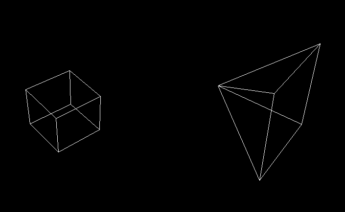

# C 3D Graphic Engine
> **C3DGraphicEngine** - это графический 3D движок, написанный с полного нуля на чистом С!
### [Скачайте](./builds/v0.1.exe) и попробуйте сами!




## Стек:
- [C23](https://ru.wikipedia.org/wiki/C23)
- [windows.h](https://ru.wikipedia.org/wiki/Windows.h)
- ВСЁ! :smirk:

## О проекте:
- Графический 3D движок 
- Весит всего 75 Kb!
- Первая версия написана за 8 часов
- Рендерит произвольные объекты, заданные как наборы вершин и ребер
- Реализует сцену с произвольным позиционированием камеры
- Использует перспективную проекцию
- Создан с полного нуля:
  - Не использует продвинутые графические библиотеки
  - Основан на [Windows API](https://ru.wikipedia.org/wiki/Windows_API) (использует функции создания окон, рисования точек, линий)
  
## Запуск:
- Make:
    ```bash
    make
    make run
    ```
- GCC:
    ```bash
    gcc -o main.exe .\main.c .\utils\utils.c -lgdi32
    .\main.exe
    ```

## Идеи:
- [ ] Добавить непрозрачность (скрыть невидимые грани)
- [ ] Добавить алгоритмы создания сложных фигур (додекаэдр, шар и тд.)
- [ ] Добавить физику
- [ ] Have fun!

### Над проектом работали [StepanovPlaton](https://github.com/StepanovPlaton) и [Fluorouacil](https://github.com/Fluorouacil)!